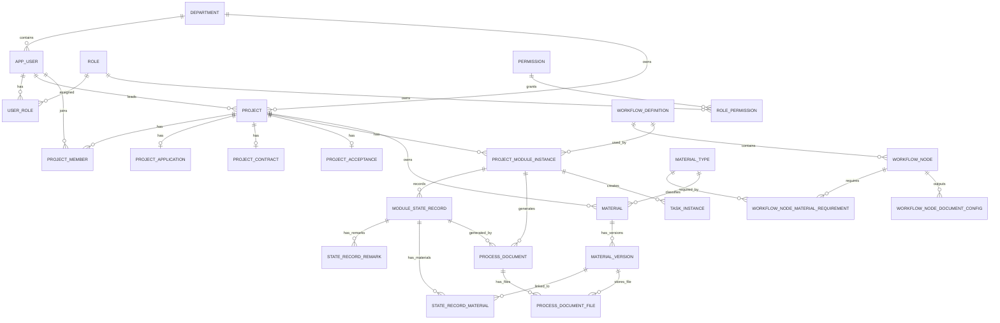

# 基于 BPMN 状态机的科研项目流程管理系统数据库与运行时设计（合并版）

> 合并说明：本文档以第一个设计文档为主设计文档。若与第二个设计文档存在冲突，以第一个设计文档为准。第二个文档中关于 SSE 更新流程、事务提交后通知、前端重新拉取 ViewModel、后端通知服务和事务设计的内容已并入第十一部分之后，作为 ViewModel 与前端同步机制的补充说明。


## 1. 设计目标与适用范围

本设计面向科研项目管理系统第一版，重点支持以下三个核心业务模块：

```text
项目申报 APPLICATION
纵向合同 CONTRACT
项目结题 ACCEPTANCE
```

系统采用“BPMN 定义流程 + 状态机推进状态 + 业务表保存业务事实 + 材料表保存文件版本 + 单据表固化结果单据”的设计方式，目标是在保持数据库结构简洁的前提下，支持后续通过新增 BPMN 文件扩展新的业务流程或业务模块。

整体目标如下：

1. 使用 BPMN 文件定义流程节点、节点顺序、退回路径、Gateway 条件、候选处理角色、材料要求和单据输出配置；
2. BPMN 加载后自动生成 `workflow_definition`、`workflow_node`、`workflow_node_material_requirement`、`workflow_node_document_config` 等流程配置数据；
3. 使用 `project_module_instance` 表描述某个项目的某个业务模块流程实例；
4. 使用 `module_state_record` 追加记录状态迁移事实，而不是直接覆盖业务表状态字段；
5. 使用 `state_record_remark` 统一记录操作人、参与者、审核意见、专家意见、代录说明和系统说明；
6. 使用 `state_record_material` 记录某次状态迁移或某条意见关联的材料版本；
7. 使用 `material_type`、`material`、`material_version` 统一管理材料类型、逻辑材料和文件版本；
8. 使用 `process_document` 和 `process_document_file` 在关键节点或流程结束时固化正式单据；
9. 数据库层只保留少量通用视图，具体节点页面、材料状态、单据内容由后端 ViewModel 组装器动态组装；
10. 普通流程逻辑通过默认状态机、默认条件判断器和默认材料校验器处理，复杂业务通过可插拔 `Validator`、`ConditionHandler`、`ActionHandler` 扩展。

## 2. 总体架构

系统整体运行链路如下：

```text
BPMN 文件
  ↓
流程发布器解析 BPMN
  ↓
workflow_definition / workflow_node / material_type / node requirement / document config
  ↓
前端根据后端 ViewModel 展示表单、材料、按钮、BPMN 高亮
  ↓
用户提交表单 / 审核 / 退回 / 代录外部结果
  ↓
Business Service 保存业务数据
  ↓
StateMachineRuntime 执行状态迁移
  ↓
Validator / ConditionHandler / ActionHandler 按配置执行
  ↓
module_state_record 追加状态迁移事实
  ↓
state_record_remark 记录操作人和意见
  ↓
state_record_material 关联材料版本
  ↓
task_instance 更新待办
  ↓
process_document 固化正式单据
  ↓
SSE 通知前端重新拉取 ViewModel
```

系统设计分为三个主题：

```text
（1）权限管理
（2）BPMN 状态机
（3）业务数据
```

---

# 第一部分：权限管理设计

## 3. 权限管理设计目标

第一版采用基础 RBAC 设计，避免过早引入复杂字段级权限、行级权限表达式和动态授权机制。

权限判断主要由四部分组成：

```text
1. 用户是否拥有接口/菜单/按钮权限；
2. 用户是否能访问当前项目；
3. 用户角色是否匹配当前 BPMN 节点的 candidateRole；
4. 用户是否是当前 task_instance 的处理人或候选角色成员。
```

第一版建议保留以下角色：

| 角色编码 | 角色名称 | 说明 |
|---|---|---|
| `SYSTEM_ADMIN` | 系统管理员 | 用户、角色、权限、流程配置管理 |
| `PROJECT_LEADER` | 项目负责人 | 发起申报、提交合同、提交结题 |
| `DEPT_ADMIN` | 二级单位管理员 | 审核本单位项目 |
| `SCIENCE_ADMIN` | 科技处管理员 | 科技处审核、确认、代录外部结果 |
| `EXPERT` | 专家 | 专家评审 |

对于“科技主管部门、第三方机构、学校、校领导”等不登录系统的主体，第一版不强制建模为系统用户，而是在 BPMN 节点中通过 `responsible_actor` 和 `represented_actor` 表示真实业务主体，由系统内角色代为登记结果。

## 4. 权限管理表设计

### 4.1 `department`

组织机构表。

| 字段 | 类型 | 说明 |
|---|---|---|
| `dept_id` | BIGINT PK | 部门 ID |
| `dept_code` | VARCHAR | 部门编码 |
| `dept_name` | VARCHAR | 部门名称 |
| `parent_dept_id` | BIGINT FK | 上级部门 |
| `enabled` | BOOLEAN | 是否启用 |
| `created_at` | DATETIME | 创建时间 |
| `updated_at` | DATETIME | 更新时间 |

### 4.2 `app_user`

系统用户表。

| 字段 | 类型 | 说明 |
|---|---|---|
| `user_id` | BIGINT PK | 用户 ID |
| `username` | VARCHAR UNIQUE | 登录名 |
| `password_hash` | VARCHAR | 密码哈希 |
| `real_name` | VARCHAR | 真实姓名 |
| `dept_id` | BIGINT FK | 所属部门 |
| `phone` | VARCHAR | 手机号 |
| `email` | VARCHAR | 邮箱 |
| `enabled` | BOOLEAN | 是否启用 |
| `created_at` | DATETIME | 创建时间 |
| `updated_at` | DATETIME | 更新时间 |

### 4.3 `role`

角色表。

| 字段 | 类型 | 说明 |
|---|---|---|
| `role_id` | BIGINT PK | 角色 ID |
| `role_code` | VARCHAR UNIQUE | 角色编码 |
| `role_name` | VARCHAR | 角色名称 |
| `role_desc` | TEXT | 角色描述 |
| `enabled` | BOOLEAN | 是否启用 |

### 4.4 `permission`

权限表。

| 字段 | 类型 | 说明 |
|---|---|---|
| `permission_id` | BIGINT PK | 权限 ID |
| `permission_code` | VARCHAR UNIQUE | 权限编码 |
| `permission_name` | VARCHAR | 权限名称 |
| `permission_type` | VARCHAR | `MENU / API / BUTTON` |
| `permission_desc` | TEXT | 权限说明 |

### 4.5 `user_role`

用户角色关系表。

| 字段 | 类型 | 说明 |
|---|---|---|
| `user_role_id` | BIGINT PK | 主键 |
| `user_id` | BIGINT FK | 用户 ID |
| `role_id` | BIGINT FK | 角色 ID |
| `assigned_at` | DATETIME | 分配时间 |

### 4.6 `role_permission`

角色权限关系表。

| 字段 | 类型 | 说明 |
|---|---|---|
| `role_permission_id` | BIGINT PK | 主键 |
| `role_id` | BIGINT FK | 角色 ID |
| `permission_id` | BIGINT FK | 权限 ID |

## 5. 权限管理通用视图

### 5.1 `v_user_role_detail`

用于统一查询用户、部门和角色。

```sql
CREATE VIEW v_user_role_detail AS
SELECT
    u.user_id,
    u.username,
    u.real_name,
    u.dept_id,
    d.dept_name,
    r.role_id,
    r.role_code,
    r.role_name
FROM app_user u
LEFT JOIN department d
    ON d.dept_id = u.dept_id
LEFT JOIN user_role ur
    ON ur.user_id = u.user_id
LEFT JOIN role r
    ON r.role_id = ur.role_id
WHERE u.enabled = TRUE;
```

该视图用于：

```text
判断用户是否拥有某角色；
判断用户所属部门；
判断用户是否能处理当前 BPMN 节点 candidateRole；
判断二级单位管理员是否只能访问本单位项目。
```

---

# 第二部分：BPMN 状态机设计

## 6. BPMN 状态机设计目标

BPMN 状态机部分负责流程定义、节点配置、状态迁移、材料要求、单据输出、意见记录、材料关联和待办任务。

核心思想如下：

```text
BPMN 负责定义流程；
workflow_node 负责保存 BPMN 节点与稳定状态编码的映射；
project_module_instance 负责表示项目的某个模块流程实例；
module_state_record 负责追加状态迁移事实；
state_record_remark 负责记录所有参与者意见和实际操作人；
state_record_material 负责记录节点或意见关联的材料版本；
task_instance 负责当前待办。
```

当前状态不写在业务表中，而是从 `module_state_record` 的最新记录中计算得到。

## 7. BPMN 状态机表设计

### 7.1 `workflow_definition`

流程定义表，保存 BPMN XML 和解析后的状态迁移规则。

| 字段 | 类型 | 说明 |
|---|---|---|
| `workflow_definition_id` | BIGINT PK | 流程定义 ID |
| `process_key` | VARCHAR | 流程编码 |
| `process_name` | VARCHAR | 流程名称 |
| `module_type` | VARCHAR | 模块类型 |
| `bpmn_xml` | LONGTEXT | BPMN 原始 XML |
| `state_machine_rules_json` | JSON | 状态迁移规则 JSON |
| `version_no` | INT | 流程版本 |
| `status` | VARCHAR | `DRAFT / ACTIVE / DISABLED` |
| `created_at` | DATETIME | 创建时间 |
| `updated_at` | DATETIME | 更新时间 |

建议唯一约束：

```sql
UNIQUE (process_key, version_no)
```

典型流程定义：

| process_key | module_type | 说明 |
|---|---|---|
| `APPLICATION_PROCESS` | `APPLICATION` | 项目申报流程 |
| `CONTRACT_PROCESS` | `CONTRACT` | 纵向合同流程 |
| `ACCEPTANCE_PROCESS` | `ACCEPTANCE` | 项目结题流程 |

### 7.2 `workflow_node`

BPMN 节点表，由 BPMN 加载时自动生成。

| 字段 | 类型 | 说明 |
|---|---|---|
| `workflow_node_id` | BIGINT PK | 节点记录 ID |
| `workflow_definition_id` | BIGINT FK | 所属流程定义 |
| `node_id` | VARCHAR | BPMN 节点 ID |
| `node_name` | VARCHAR | BPMN 节点名称 |
| `node_type` | VARCHAR | `START_EVENT / USER_TASK / SERVICE_TASK / GATEWAY / END_EVENT` |
| `state_code` | VARCHAR | 稳定状态编码，Gateway 可为空 |
| `lane_name` | VARCHAR | BPMN 泳道名称 |
| `responsible_actor_code` | VARCHAR | 业务责任主体编码 |
| `responsible_actor_name` | VARCHAR | 业务责任主体名称 |
| `candidate_role_code` | VARCHAR | 系统候选操作角色 |
| `operation_mode` | VARCHAR | `SELF_OPERATE / PROXY_INPUT / SYSTEM_AUTO` |
| `represented_actor_code` | VARCHAR | 代录代表主体编码 |
| `represented_actor_name` | VARCHAR | 代录代表主体名称 |
| `created_at` | DATETIME | 创建时间 |

建议约束：

```sql
UNIQUE (workflow_definition_id, node_id);
UNIQUE (workflow_definition_id, state_code);
```

说明：

```text
lane_name / responsible_actor 表示业务上谁负责；
candidate_role_code 表示系统中谁能处理该节点；
represented_actor 表示代录场景中实际代表的外部主体。
```

### 7.3 `workflow_node_material_requirement`

节点材料要求表，由 BPMN `materialRequirement` 扩展元素生成。

| 字段 | 类型 | 说明 |
|---|---|---|
| `requirement_id` | BIGINT PK | 主键 |
| `workflow_node_id` | BIGINT FK | 所属 BPMN 节点 |
| `material_type_id` | BIGINT FK | 材料类型 |
| `requirement_timing` | VARCHAR | `BEFORE_ENTER / BEFORE_SUBMIT / AFTER_COMPLETE` |
| `required` | BOOLEAN | 是否必填 |
| `min_count` | INT | 最小数量 |
| `max_count` | INT | 最大数量 |
| `usage_type` | VARCHAR | `SUBMITTED_FILE / PROOF_FILE / SIGNED_FILE / REVIEW_ATTACHMENT` |
| `validator_key` | VARCHAR | 可选，自定义材料校验器 |
| `description` | TEXT | 说明 |

### 7.4 `workflow_node_document_config`

节点单据输出配置表，由 BPMN `documentConfig` 扩展元素生成。

| 字段 | 类型 | 说明 |
|---|---|---|
| `document_config_id` | BIGINT PK | 主键 |
| `workflow_node_id` | BIGINT FK | 所属节点 |
| `document_type_code` | VARCHAR | 单据类型编码 |
| `document_type_name` | VARCHAR | 单据名称 |
| `generate_timing` | VARCHAR | `ON_NODE_COMPLETE / ON_PROCESS_END / MANUAL_GENERATE` |
| `template_code` | VARCHAR | 模板编码 |
| `snapshot_schema_json` | JSON | 快照结构配置 |
| `snapshot_view_name` | VARCHAR | 可选，单据数据源视图名 |
| `output_material_type_id` | BIGINT FK | 生成文件对应的材料类型 |
| `required` | BOOLEAN | 是否必须生成 |
| `enabled` | BOOLEAN | 是否启用 |

### 7.5 `project_module_instance`

项目模块流程实例表。

| 字段 | 类型 | 说明 |
|---|---|---|
| `module_instance_id` | BIGINT PK | 模块实例 ID |
| `project_id` | BIGINT FK | 所属项目 |
| `module_type` | VARCHAR | 模块类型 |
| `workflow_definition_id` | BIGINT FK | 使用的流程定义版本 |
| `started_at` | DATETIME | 开始时间 |
| `finished_at` | DATETIME | 完成时间 |
| `created_at` | DATETIME | 创建时间 |
| `updated_at` | DATETIME | 更新时间 |

第一版建议约束：

```sql
UNIQUE (project_id, module_type)
```

### 7.6 `module_state_record`

状态迁移事实表，只追加，不覆盖。

| 字段 | 类型 | 说明 |
|---|---|---|
| `state_record_id` | BIGINT PK | 状态记录 ID |
| `module_instance_id` | BIGINT FK | 所属模块实例 |
| `seq` | INT | 模块内递增序号 |
| `round_no` | INT | 第几轮 |
| `event_type` | VARCHAR | 触发事件 |
| `from_state` | VARCHAR | 原状态 |
| `to_state` | VARCHAR | 新状态 |
| `from_node_id` | VARCHAR | 来源 BPMN 节点 |
| `to_node_id` | VARCHAR | 目标 BPMN 节点 |
| `result` | VARCHAR | 总体结果 |
| `summary` | VARCHAR | 状态迁移摘要 |
| `payload_json` | JSON | 条件变量、上下文 |
| `created_at` | DATETIME | 创建时间 |

不保存 `operator_user_id`，实际操作人由 `state_record_remark.is_operator = true` 表示。

建议约束：

```sql
UNIQUE (module_instance_id, seq)
```

### 7.7 `state_record_remark`

状态记录意见表，统一记录操作人、审核人、专家、代录人、系统说明等。

| 字段 | 类型 | 说明 |
|---|---|---|
| `remark_id` | BIGINT PK | 主键 |
| `state_record_id` | BIGINT FK | 所属状态记录 |
| `participant_user_id` | BIGINT FK | 参与用户，可空 |
| `participant_role_id` | BIGINT FK | 参与角色，可空 |
| `participant_type` | VARCHAR | `OPERATOR / APPROVER / EXPERT / PROXY_OPERATOR / SYSTEM` |
| `action_type` | VARCHAR | `SUBMIT / APPROVE / RETURN / REVIEW / REGISTER_RESULT` |
| `result` | VARCHAR | 个人结果 |
| `is_operator` | BOOLEAN | 是否为实际触发状态迁移的人 |
| `score` | DECIMAL | 评分，可空 |
| `remark_content` | TEXT | 意见内容 |
| `is_final` | BOOLEAN | 是否最终有效 |
| `sort_no` | INT | 排序 |
| `created_at` | DATETIME | 创建时间 |

设计说明：

```text
每次 module_state_record 至少应有一条 is_operator = true 的 remark；
普通审核节点通常只有一条 remark；
专家评审节点可以有多条 remark；
系统自动迁移可使用 participant_type = SYSTEM。
```

### 7.8 `state_record_material`

状态记录材料关联表。

| 字段 | 类型 | 说明 |
|---|---|---|
| `record_material_id` | BIGINT PK | 主键 |
| `state_record_id` | BIGINT FK | 所属状态记录 |
| `remark_id` | BIGINT FK | 可选，关联某条意见 |
| `material_version_id` | BIGINT FK | 材料版本 |
| `material_usage` | VARCHAR | 材料用途 |
| `is_required` | BOOLEAN | 是否必填 |
| `linked_at` | DATETIME | 关联时间 |

如果材料属于整个节点，`remark_id` 为空；如果材料属于某个参与者意见，则关联具体 `remark_id`。

### 7.9 `task_instance`

待办任务表。

| 字段 | 类型 | 说明 |
|---|---|---|
| `task_instance_id` | BIGINT PK | 待办 ID |
| `module_instance_id` | BIGINT FK | 模块实例 |
| `node_id` | VARCHAR | BPMN 节点 ID |
| `state_code` | VARCHAR | 状态编码 |
| `assignee_user_id` | BIGINT FK | 明确处理人，可空 |
| `candidate_role_code` | VARCHAR | 候选角色 |
| `task_status` | VARCHAR | `PENDING / CLAIMED / COMPLETED / CANCELED` |
| `round_no` | INT | 轮次 |
| `created_at` | DATETIME | 创建时间 |
| `claimed_at` | DATETIME | 领取时间 |
| `completed_at` | DATETIME | 完成时间 |
| `deadline_at` | DATETIME | 截止时间 |

`task_instance` 表示“当前谁需要办”，`module_state_record` 表示“历史发生过什么”，两者职责不同。

## 8. BPMN 状态机通用视图

数据库层只保留三类与状态机有关的通用视图。

### 8.1 `v_workflow_node_config`

统一查询 BPMN 节点配置。

```sql
CREATE VIEW v_workflow_node_config AS
SELECT
    wn.workflow_node_id,
    wn.workflow_definition_id,
    wd.process_key,
    wd.process_name,
    wd.version_no,
    wd.module_type,
    wn.node_id,
    wn.node_name,
    wn.node_type,
    wn.state_code,
    wn.lane_name,
    wn.responsible_actor_code,
    wn.responsible_actor_name,
    wn.candidate_role_code,
    wn.operation_mode,
    wn.represented_actor_code,
    wn.represented_actor_name
FROM workflow_node wn
JOIN workflow_definition wd
    ON wd.workflow_definition_id = wn.workflow_definition_id;
```

### 8.2 `v_module_runtime_context`

统一查询模块当前运行状态。

```sql
CREATE VIEW v_module_runtime_context AS
SELECT
    pmi.module_instance_id,
    pmi.project_id,
    pmi.module_type,
    pmi.workflow_definition_id,
    pmi.started_at,
    pmi.finished_at,
    cs.current_seq,
    cs.current_round_no,
    cs.current_state,
    cs.current_node_id,
    cs.last_event_type,
    cs.last_result,
    cs.last_summary,
    cs.last_transition_time,
    wn.workflow_node_id AS current_workflow_node_id,
    wn.node_name AS current_node_name,
    wn.node_type AS current_node_type,
    wn.lane_name AS current_lane_name,
    wn.responsible_actor_code AS current_responsible_actor_code,
    wn.responsible_actor_name AS current_responsible_actor_name,
    wn.candidate_role_code AS current_candidate_role_code,
    wn.operation_mode AS current_operation_mode,
    wn.represented_actor_code AS current_represented_actor_code,
    wn.represented_actor_name AS current_represented_actor_name
FROM project_module_instance pmi
LEFT JOIN (
    SELECT
        t.module_instance_id,
        t.seq AS current_seq,
        t.round_no AS current_round_no,
        t.to_state AS current_state,
        t.to_node_id AS current_node_id,
        t.event_type AS last_event_type,
        t.result AS last_result,
        t.summary AS last_summary,
        t.created_at AS last_transition_time
    FROM (
        SELECT
            r.*,
            ROW_NUMBER() OVER (
                PARTITION BY r.module_instance_id
                ORDER BY r.seq DESC, r.state_record_id DESC
            ) AS rn
        FROM module_state_record r
    ) t
    WHERE t.rn = 1
) cs
    ON cs.module_instance_id = pmi.module_instance_id
LEFT JOIN v_workflow_node_config wn
    ON wn.workflow_definition_id = pmi.workflow_definition_id
   AND wn.state_code = cs.current_state;
```

### 8.3 `v_state_record_context`

统一查询状态迁移历史和实际操作人。

```sql
CREATE VIEW v_state_record_context AS
SELECT
    msr.state_record_id,
    msr.module_instance_id,
    pmi.project_id,
    pmi.module_type,
    pmi.workflow_definition_id,
    msr.seq,
    msr.round_no,
    msr.event_type,
    msr.from_state,
    msr.to_state,
    msr.from_node_id,
    msr.to_node_id,
    msr.result,
    msr.summary,
    msr.payload_json,
    msr.created_at AS transition_time,
    wn.workflow_node_id AS to_workflow_node_id,
    wn.node_name AS to_node_name,
    wn.node_type AS to_node_type,
    wn.lane_name AS to_lane_name,
    wn.responsible_actor_name AS to_responsible_actor_name,
    wn.operation_mode AS to_operation_mode,
    wn.represented_actor_name AS to_represented_actor_name,
    op.remark_id AS operator_remark_id,
    op.participant_user_id AS operator_user_id,
    operator_user.real_name AS operator_name,
    op.participant_role_id AS operator_role_id,
    operator_role.role_code AS operator_role_code,
    operator_role.role_name AS operator_role_name,
    op.participant_type AS operator_participant_type,
    op.action_type AS operator_action_type,
    op.remark_content AS operator_remark
FROM module_state_record msr
JOIN project_module_instance pmi
    ON pmi.module_instance_id = msr.module_instance_id
LEFT JOIN v_workflow_node_config wn
    ON wn.workflow_definition_id = pmi.workflow_definition_id
   AND wn.state_code = msr.to_state
LEFT JOIN state_record_remark op
    ON op.state_record_id = msr.state_record_id
   AND op.is_operator = TRUE
LEFT JOIN app_user operator_user
    ON operator_user.user_id = op.participant_user_id
LEFT JOIN role operator_role
    ON operator_role.role_id = op.participant_role_id;
```

---

# 第三部分：业务数据设计

## 9. 业务数据设计目标

业务数据表只保存业务事实，不直接承担流程状态判断。流程状态由 `module_state_record` 和 `v_module_runtime_context` 提供。

第一版保留：

```text
project
project_member
project_application
project_contract
project_acceptance
material_type
material
material_version
process_document
process_document_file
```

## 10. 业务表设计

### 10.1 `project`

项目主表。

| 字段 | 类型 | 说明 |
|---|---|---|
| `project_id` | BIGINT PK | 项目 ID |
| `project_code` | VARCHAR UNIQUE | 项目编号 |
| `project_name` | VARCHAR | 项目名称 |
| `leader_user_id` | BIGINT FK | 项目负责人 |
| `dept_id` | BIGINT FK | 所属二级单位 |
| `project_type` | VARCHAR | 项目类型 |
| `project_level` | VARCHAR | 项目级别 |
| `approved_amount` | DECIMAL | 批准经费 |
| `start_date` | DATE | 开始时间 |
| `end_date` | DATE | 结束时间 |
| `lifecycle_stage` | VARCHAR | 项目生命周期阶段 |
| `created_at` | DATETIME | 创建时间 |
| `updated_at` | DATETIME | 更新时间 |

`lifecycle_stage` 只表示项目大阶段，例如：

```text
APPLICATION
CONTRACT
EXECUTING
ACCEPTANCE
FINISHED
```

### 10.2 `project_member`

项目成员表。

| 字段 | 类型 | 说明 |
|---|---|---|
| `project_member_id` | BIGINT PK | 主键 |
| `project_id` | BIGINT FK | 项目 ID |
| `user_id` | BIGINT FK | 用户 ID |
| `member_role` | VARCHAR | 项目内角色 |
| `responsibility` | TEXT | 分工说明 |
| `joined_at` | DATETIME | 加入时间 |

### 10.3 `project_application`

项目申报表。

| 字段 | 类型 | 说明 |
|---|---|---|
| `application_id` | BIGINT PK | 申报 ID |
| `project_id` | BIGINT FK | 项目 ID |
| `application_title` | VARCHAR | 申报标题 |
| `is_limited_project` | BOOLEAN | 是否限项 |
| `submitted_at` | DATETIME | 提交时间 |
| `approved_at` | DATETIME | 批准时间 |
| `application_summary` | TEXT | 申报摘要 |
| `created_at` | DATETIME | 创建时间 |
| `updated_at` | DATETIME | 更新时间 |

### 10.4 `project_contract`

纵向合同表。

| 字段 | 类型 | 说明 |
|---|---|---|
| `contract_id` | BIGINT PK | 合同 ID |
| `project_id` | BIGINT FK | 项目 ID |
| `contract_code` | VARCHAR UNIQUE | 合同编号 |
| `contract_name` | VARCHAR | 合同名称 |
| `contract_amount` | DECIMAL | 合同金额 |
| `contract_start_date` | DATE | 合同开始日期 |
| `contract_end_date` | DATE | 合同结束日期 |
| `seal_status` | VARCHAR | 盖章状态 |
| `submitted_at` | DATETIME | 提交时间 |
| `signed_at` | DATETIME | 签订时间 |
| `archived_at` | DATETIME | 归档时间 |
| `created_at` | DATETIME | 创建时间 |
| `updated_at` | DATETIME | 更新时间 |

第一版只做纵向合同，可暂不设计 `contract_type`。

### 10.5 `project_acceptance`

项目结题表。

| 字段 | 类型 | 说明 |
|---|---|---|
| `acceptance_id` | BIGINT PK | 结题 ID |
| `project_id` | BIGINT FK | 项目 ID |
| `submitted_at` | DATETIME | 提交时间 |
| `completed_at` | DATETIME | 完成时间 |
| `certificate_no` | VARCHAR | 结题证书编号 |
| `conclusion` | TEXT | 结题结论 |
| `created_at` | DATETIME | 创建时间 |
| `updated_at` | DATETIME | 更新时间 |

### 10.6 `material_type`

材料类型表。BPMN 加载时可自动注册所需材料类型。

| 字段 | 类型 | 说明 |
|---|---|---|
| `material_type_id` | BIGINT PK | 材料类型 ID |
| `material_type_code` | VARCHAR UNIQUE | 材料类型编码 |
| `material_type_name` | VARCHAR | 材料类型名称 |
| `module_type` | VARCHAR | 所属模块，可空 |
| `allowed_file_types` | VARCHAR | 允许文件类型 |
| `max_file_size_mb` | INT | 最大文件大小 |
| `enabled` | BOOLEAN | 是否启用 |
| `created_at` | DATETIME | 创建时间 |
| `updated_at` | DATETIME | 更新时间 |

### 10.7 `material`

逻辑材料表。

| 字段 | 类型 | 说明 |
|---|---|---|
| `material_id` | BIGINT PK | 材料 ID |
| `project_id` | BIGINT FK | 项目 ID |
| `material_type_id` | BIGINT FK | 材料类型 |
| `created_by` | BIGINT FK | 创建人 |
| `created_at` | DATETIME | 创建时间 |

一个 `material` 表示一个逻辑材料，例如“项目申请书”。

### 10.8 `material_version`

材料版本表。

| 字段 | 类型 | 说明 |
|---|---|---|
| `material_version_id` | BIGINT PK | 材料版本 ID |
| `material_id` | BIGINT FK | 材料 ID |
| `version_no` | INT | 版本号 |
| `file_name` | VARCHAR | 文件名 |
| `file_url` | VARCHAR | 文件路径 |
| `file_hash` | VARCHAR | 文件哈希 |
| `uploaded_by` | BIGINT FK | 上传人 |
| `uploaded_at` | DATETIME | 上传时间 |
| `is_current` | BOOLEAN | 是否当前版本 |

### 10.9 `process_document`

正式流程单据表。

| 字段 | 类型 | 说明 |
|---|---|---|
| `document_id` | BIGINT PK | 单据 ID |
| `module_instance_id` | BIGINT FK | 模块实例 |
| `generated_state_record_id` | BIGINT FK | 由哪次状态记录生成 |
| `document_type_code` | VARCHAR | 单据类型编码 |
| `document_no` | VARCHAR | 单据编号 |
| `document_title` | VARCHAR | 单据标题 |
| `document_status` | VARCHAR | 单据状态 |
| `snapshot_json` | JSON | 生成时快照 |
| `generated_at` | DATETIME | 生成时间 |

说明：

```text
视图和 ViewModel 负责组合实时结果；
process_document 负责固化正式单据快照，避免历史单据随业务数据变化而漂移。
```

### 10.10 `process_document_file`

正式单据文件关系表。

| 字段 | 类型 | 说明 |
|---|---|---|
| `document_file_id` | BIGINT PK | 主键 |
| `document_id` | BIGINT FK | 单据 ID |
| `material_version_id` | BIGINT FK | 文件版本 ID |
| `file_purpose` | VARCHAR | `PDF / WORD / SCAN / ATTACHMENT` |
| `is_main_file` | BOOLEAN | 是否主文件 |

## 11. 业务通用视图

### 11.1 `v_material_context`

统一查询材料类型、逻辑材料、材料版本和上传人。

```sql
CREATE VIEW v_material_context AS
SELECT
    m.material_id,
    m.project_id,
    mt.material_type_id,
    mt.material_type_code,
    mt.material_type_name,
    mt.module_type,
    mt.allowed_file_types,
    mt.max_file_size_mb,
    mv.material_version_id,
    mv.version_no,
    mv.file_name,
    mv.file_url,
    mv.file_hash,
    mv.uploaded_by,
    uploader.real_name AS uploaded_by_name,
    mv.uploaded_at,
    mv.is_current
FROM material m
JOIN material_type mt
    ON mt.material_type_id = m.material_type_id
JOIN material_version mv
    ON mv.material_id = m.material_id
LEFT JOIN app_user uploader
    ON uploader.user_id = mv.uploaded_by;
```

该视图用于：

```text
材料列表；
材料版本追溯；
节点材料校验；
状态记录附件展示；
正式单据附件展示。
```

---

# 第四部分：BPMN 文件结构化定义

## 12. BPMN 扩展属性设计

建议使用 BPMN `extensionElements` 表达系统运行所需配置。

自定义命名空间示例：

```xml
xmlns:rm="http://example.com/research-management"
```

## 13. 节点基本信息定义

```xml
<bpmn:userTask id="AuthorityReviewResultTask" name="登记主管部门审核结果">
  <bpmn:extensionElements>
    <rm:workflowNode
        stateCode="APPLICATION_AUTHORITY_REVIEWING"
        responsibleActorCode="AUTHORITY_DEPARTMENT"
        responsibleActorName="科技主管部门"
        candidateRoleCode="SCIENCE_ADMIN"
        operationMode="PROXY_INPUT"
        representedActorCode="AUTHORITY_DEPARTMENT"
        representedActorName="科技主管部门" />
  </bpmn:extensionElements>
</bpmn:userTask>
```

含义：

```text
业务责任主体：科技主管部门；
系统操作角色：科技处管理员；
操作模式：代录；
代录代表主体：科技主管部门。
```

## 14. 节点材料要求定义

```xml
<rm:materialRequirement
    materialTypeCode="AUTHORITY_APPROVAL_FILE"
    materialTypeName="主管部门批复文件"
    requirementTiming="BEFORE_SUBMIT"
    required="true"
    minCount="1"
    usageType="PROOF_FILE"
    allowedFileTypes="pdf,jpg,png"
    maxFileSizeMb="20" />
```

加载 BPMN 时系统自动：

```text
1. 注册或更新 material_type；
2. 生成 workflow_node_material_requirement；
3. 后续由默认材料校验器校验材料完整性。
```

## 15. 节点单据输出定义

```xml
<rm:documentConfig
    documentTypeCode="APPLICATION_APPROVAL_FORM"
    documentTypeName="项目申报审批单"
    generateTiming="ON_PROCESS_END"
    templateCode="tpl_application_approval_form"
    outputMaterialTypeCode="APPLICATION_APPROVAL_FORM_PDF"
    outputMaterialTypeName="项目申报审批单PDF"
    required="true" />
```

加载后生成：

```text
workflow_node_document_config
material_type: APPLICATION_APPROVAL_FORM_PDF
```

## 16. Gateway 与状态迁移定义

简单 bool 判断：

```xml
<bpmn:sequenceFlow
    id="Flow_Dept_Approve"
    sourceRef="DeptReviewTask"
    targetRef="ScienceReviewTask">
  <bpmn:extensionElements>
    <rm:transition
        eventType="DEPT_APPROVE"
        result="APPROVED"
        conditionType="SIMPLE_BOOL"
        conditionKey="deptApproved"
        conditionValue="true" />
  </bpmn:extensionElements>
</bpmn:sequenceFlow>
```

复杂条件：

```xml
<rm:transition
    eventType="EXPERT_REVIEW_FINISHED"
    result="PASSED"
    conditionType="CUSTOM"
    conditionHandlerKey="EXPERT_REVIEW_PASS_CONDITION"
    actionKeys="CALCULATE_EXPERT_SCORE,GENERATE_REVIEW_SUMMARY" />
```

---

# 第五部分：流程发布器设计

## 17. BPMN 加载与发布流程

流程发布器执行步骤：

```text
1. 读取 BPMN XML；
2. 校验 BPMN 基本结构；
3. 保存 workflow_definition.bpmn_xml；
4. 遍历 laneSet，建立 node_id → lane_name 映射；
5. 遍历 startEvent / userTask / serviceTask / endEvent / gateway；
6. 读取 rm:workflowNode，生成 workflow_node；
7. 读取 rm:materialRequirement；
8. 根据 materialTypeCode 自动注册 material_type；
9. 生成 workflow_node_material_requirement；
10. 读取 rm:documentConfig；
11. 根据 outputMaterialTypeCode 自动注册输出材料类型；
12. 生成 workflow_node_document_config；
13. 解析 sequenceFlow；
14. 读取 rm:transition 和 conditionExpression；
15. 生成 state_machine_rules_json；
16. 校验 stateCode、nodeId、roleCode、materialTypeCode、eventType 是否合法；
17. 发布 workflow_definition 为 ACTIVE。
```

## 18. BPMN 发布校验规则

发布前至少校验：

```text
stateCode 在同一流程版本内唯一；
node_id 在同一流程版本内唯一；
candidateRoleCode 在系统角色中存在；
materialTypeCode 合法；
sequenceFlow 必须配置 eventType；
Gateway 出边条件不能冲突；
结束节点如需归档，必须配置 documentConfig；
required 材料必须能在节点提交前上传；
CUSTOM conditionHandlerKey 必须存在对应 Handler；
actionKeys 必须存在对应 ActionHandler；
validatorKey 必须存在对应 Validator。
```

## 19. 流程版本策略

不建议覆盖旧 BPMN。

推荐：

```text
APPLICATION_PROCESS v1
APPLICATION_PROCESS v2
APPLICATION_PROCESS v3
```

规则：

```text
已启动模块实例继续绑定旧 workflow_definition_id；
新项目使用最新 ACTIVE 版本；
旧版本可以 DISABLED，但不应删除；
如果节点和状态迁移发生变化，应发布新版本；
不要随意修改已使用 state_code 的语义。
```

---

# 第六部分：StateMachineRuntime 设计

## 20. 状态机运行时职责

状态机运行时负责：

```text
1. 锁定 project_module_instance；
2. 查询当前状态；
3. 匹配 transition rule；
4. 执行条件判断；
5. 执行 Validator；
6. 写入 module_state_record；
7. 写入 state_record_remark；
8. 写入 state_record_material；
9. 执行 ActionHandler；
10. 更新 task_instance；
11. 触发单据生成；
12. 事务提交后发布 SSE 通知。
```

## 21. 状态迁移默认流程

```text
1. 前端提交 eventType、payload、意见、材料版本 ID；
2. Business Service 保存业务表数据；
3. StateMachineRuntime 锁定模块实例；
4. 读取 v_module_runtime_context；
5. 根据 current_state + eventType 匹配状态迁移规则；
6. 执行默认条件判断或自定义 ConditionHandler；
7. 执行默认材料校验器或自定义 Validator；
8. 插入 module_state_record；
9. 插入 state_record_remark，其中 is_operator = true；
10. 关联 state_record_material；
11. 关闭当前 task_instance；
12. 创建下一节点 task_instance；
13. 根据 workflow_node_document_config 生成 process_document；
14. 事务提交后发送 SSE 通知。
```

## 22. TransitionContext

统一上下文对象：

```java
public class TransitionContext {
    private Long projectId;
    private Long moduleInstanceId;
    private String moduleType;
    private Long workflowDefinitionId;

    private String currentState;
    private String currentNodeId;
    private Integer currentSeq;
    private Integer currentRoundNo;

    private String eventType;
    private String targetState;
    private String targetNodeId;

    private Long stateRecordId;

    private Long currentUserId;
    private String currentRoleCode;

    private Map<String, Object> payload;
    private List<Long> submittedMaterialVersionIds;

    private TransitionRule matchedRule;
}
```

---

# 第七部分：条件判断器设计

## 23. 默认条件判断

简单条件不需要写自定义代码，直接由默认条件判断器处理。

支持类型：

| conditionType | 说明 |
|---|---|
| `ALWAYS` | 无条件通过 |
| `SIMPLE_BOOL` | 布尔判断 |
| `EQUALS` | 枚举或字符串相等 |
| `NOT_EQUALS` | 不相等 |
| `GREATER_THAN` | 数值大于 |
| `EXPRESSION` | 简单表达式，可后续扩展 |
| `CUSTOM` | 调用自定义 ConditionHandler |

第一版建议实现：

```text
ALWAYS
SIMPLE_BOOL
EQUALS
CUSTOM
```

## 24. 自定义 ConditionHandler

接口：

```java
public interface TransitionConditionHandler {
    String conditionHandlerKey();
    boolean matches(TransitionContext context);
}
```

示例：

```java
public class ExpertReviewPassConditionHandler implements TransitionConditionHandler {
    @Override
    public String conditionHandlerKey() {
        return "EXPERT_REVIEW_PASS_CONDITION";
    }

    @Override
    public boolean matches(TransitionContext context) {
        // 读取专家评分和意见，判断是否通过
        return true;
    }
}
```

---

# 第八部分：Validator 设计

## 25. 默认材料校验器

默认材料校验器读取 `workflow_node_material_requirement`，校验当前节点所需材料。

校验内容：

```text
必填材料是否上传；
上传数量是否满足 min_count；
是否超过 max_count；
文件格式是否符合 allowed_file_types；
文件大小是否超过 max_file_size_mb；
是否使用当前有效版本。
```

## 26. NodeMaterialValidator 接口

```java
public interface NodeMaterialValidator {
    String validatorKey();
    void validate(MaterialValidationContext context);
}
```

上下文：

```java
public class MaterialValidationContext {
    private Long projectId;
    private Long moduleInstanceId;
    private String moduleType;
    private Long workflowNodeId;
    private String stateCode;
    private String eventType;
    private String requirementTiming;
    private Long currentUserId;
    private String currentRoleCode;
    private Map<String, Object> payload;
    private List<Long> submittedMaterialVersionIds;
}
```

## 27. 默认与自定义校验器的关系

默认情况：

```text
validatorKey 为空
→ 使用 DEFAULT_MATERIAL_VALIDATOR
```

复杂情况：

```xml
<rm:materialRequirement
    materialTypeCode="BUDGET_DETAIL"
    materialTypeName="预算明细表"
    required="true"
    minCount="1"
    validatorKey="BUDGET_DETAIL_VALIDATOR" />
```

后端实现：

```java
@Component
public class BudgetDetailValidator implements NodeMaterialValidator {
    @Override
    public String validatorKey() {
        return "BUDGET_DETAIL_VALIDATOR";
    }

    @Override
    public void validate(MaterialValidationContext context) {
        // 校验预算明细与申请经费是否一致
    }
}
```

---

# 第九部分：ActionHandler 设计

## 28. ActionHandler 的职责

`ActionHandler` 不决定状态能不能迁移，也不修改状态机匹配结果。它只负责状态迁移前后需要执行的附加动作。

例如：

```text
创建下一个模块；
更新项目生命周期阶段；
生成正式单据；
分配专家评审任务；
登记外部结果；
调用外部接口；
发送特殊通知。
```

普通流程不需要配置 `actionKey`，直接走默认动作。

## 29. TransitionActionHandler 接口

```java
public interface TransitionActionHandler {
    String actionKey();
    ActionPhase phase();
    void handle(TransitionContext context);
}
```

阶段：

```java
public enum ActionPhase {
    BEFORE_TRANSITION,
    AFTER_TRANSITION,
    AFTER_COMMIT
}
```

建议第一版重点支持：

```text
AFTER_TRANSITION
AFTER_COMMIT
```

## 30. 默认动作

如果 BPMN transition 未配置 `actionKey`，默认执行：

```text
写 module_state_record；
写 state_record_remark；
写 state_record_material；
关闭当前 task_instance；
根据目标节点 candidateRole 创建下一 task_instance；
检查 workflow_node_document_config 并生成单据；
发布状态变化事件；
事务提交后 SSE 通知。
```

## 31. 常见 ActionHandler

| actionKey | 说明 |
|---|---|
| `FINISH_MODULE` | 标记当前模块完成 |
| `CREATE_NEXT_MODULE` | 创建下一个业务模块实例 |
| `UPDATE_PROJECT_STAGE` | 更新项目生命周期阶段 |
| `GENERATE_DOCUMENT` | 生成正式单据 |
| `REGISTER_EXTERNAL_RESULT` | 登记外部主体结果 |
| `ASSIGN_EXPERT_TASKS` | 分配专家评审任务 |
| `CALCULATE_EXPERT_SCORE` | 计算专家评分 |
| `GENERATE_REVIEW_SUMMARY` | 生成专家评审汇总 |

示例：

```xml
<rm:transition
    eventType="APPLICATION_APPROVED"
    result="APPROVED"
    actionKeys="FINISH_MODULE,CREATE_NEXT_MODULE,UPDATE_PROJECT_STAGE,GENERATE_DOCUMENT" />
```

表示申报通过后：

```text
完成申报模块；
创建合同模块；
更新项目生命周期为 CONTRACT；
生成项目申报审批单。
```

## 32. Handler 注册机制

可以使用 Spring 自动注册。

```java
@Component
public class TransitionActionRegistry {
    private final Map<String, TransitionActionHandler> handlerMap;

    public TransitionActionRegistry(List<TransitionActionHandler> handlers) {
        this.handlerMap = handlers.stream()
            .collect(Collectors.toMap(
                TransitionActionHandler::actionKey,
                Function.identity()
            ));
    }

    public TransitionActionHandler get(String actionKey) {
        TransitionActionHandler handler = handlerMap.get(actionKey);
        if (handler == null) {
            throw new BusinessException("未知 actionKey: " + actionKey);
        }
        return handler;
    }
}
```

---

# 第十部分：默认路径与复杂路径

## 33. 默认路径

适用于普通提交、审核、退回、确认节点。

```text
BPMN transition
  + 默认条件判断
  + 默认材料校验
  + 默认状态迁移
  + 默认任务生成
  + 默认单据生成检查
```

这种场景通常只需要修改 BPMN，不需要写代码。

## 34. 复杂路径

当存在复杂判断、复杂材料校验、复杂业务动作时，配置扩展 Key。

```text
BPMN transition
  + conditionHandlerKey
  + validatorKey
  + actionKey
  + 后端可插拔组件
```

适用场景：

```text
专家评分加权；
限项名额判断；
复杂预算校验；
外部系统对接；
自动创建后续模块；
生成复杂评审汇总。
```

---

# 第十一部分：后端 ViewModel 组装设计

## 35. 不为每个节点建 SQL View

数据库层只保留五个通用基础视图：

```text
v_user_role_detail
v_workflow_node_config
v_module_runtime_context
v_state_record_context
v_material_context
```

具体节点页面由后端根据 BPMN 配置动态组装。

## 36. 节点 ViewModel 查询来源

后端组装节点页面时读取：

```text
v_module_runtime_context：当前状态和当前节点；
v_workflow_node_config：节点定义和候选角色；
workflow_node_material_requirement：节点材料要求；
workflow_node_document_config：节点单据配置；
v_state_record_context：历史状态记录；
state_record_remark：节点意见明细；
state_record_material + v_material_context：节点附件；
state_machine_rules_json：当前可执行 eventType。
```

返回给前端：

```json
{
  "node": {
    "nodeId": "AuthorityReviewResultTask",
    "nodeName": "登记主管部门审核结果",
    "stateCode": "APPLICATION_AUTHORITY_REVIEWING",
    "operationMode": "PROXY_INPUT",
    "representedActorName": "科技主管部门"
  },
  "permission": {
    "candidateRole": "SCIENCE_ADMIN",
    "canOperate": true
  },
  "requiredMaterials": [],
  "availableActions": [],
  "history": [],
  "remarks": [],
  "attachments": []
}
```

---


---

## 36.0 合并口径说明

本合并版以第一个文档 `bpmn_state_machine_database_actionhandler_design(1).md` 为主设计文档。若第二个文档中的表字段、视图命名或职责划分与第一个文档存在冲突，以第一个文档为准。

因此，第二个文档中与 SSE 相关的描述在本合并版中按以下口径理解：

```text
1. 状态迁移事实仍以 module_state_record 追加记录为准；
2. 操作人、审核意见、专家意见、代录说明仍以 state_record_remark 为准；
3. 当前待办仍以 task_instance 为准；
4. 当前运行状态优先通过 v_module_runtime_context 获取；
5. SSE 只负责发送轻量级刷新通知，不承载完整业务数据；
6. 前端收到 SSE 后必须重新拉取后端 ViewModel，不自行推断页面最终状态。
```

以下内容主要合并第二个文档中的 SSE 更新流程、事务提交后通知、前端重新拉取 ViewModel、后端通知服务和事务设计说明。

## 36.1 SSE 实时通知与前端同步更新（由第二文档并入）

由于项目流程状态发生变化后，项目负责人、当前审核人、下一环节责任人、待办列表页面、项目详情页面等多个前端界面都需要同步刷新，因此第一版可以引入 SSE（Server-Sent Events）作为轻量级实时通知机制。

SSE 的职责不是修改状态，也不是承载完整业务数据，而是向相关前端页面发送“状态已经变化，请重新拉取最新页面模型”的通知。

整体原则如下：

```text
状态修改：HTTP 接口 + 后端状态机 + 数据库事务
状态记录：module_state_record 追加写入
当前状态：v_module_runtime_context 视图计算
状态通知：SSE 推送轻量级变化事件
页面刷新：前端收到 SSE 后重新拉取 ViewModel
```

### 36.1.1 整体更新流程

引入 SSE 后，完整的前后端更新闭环如下：

```text
前端提交表单 / 审核操作
  ↓
后端 Controller
  ↓
Business Service
  ↓
业务数据表 CRUD
  ↓
StateMachineRuntime
  ↓
module_state_record 追加状态记录
  ↓
v_module_runtime_context 计算当前状态
  ↓
事务提交成功
  ↓
发布 ModuleStateChangedEvent
  ↓
SSE 通知相关前端界面
  ↓
前端收到通知后重新请求 ViewModel
  ↓
刷新 BPMN 高亮、表单、按钮、待办和时间线
```

其中，当前操作人的页面可以直接使用接口返回的最新 `ViewModel` 刷新；其他正在查看相关项目或拥有相关待办的用户，则通过 SSE 收到通知后重新拉取最新数据。

### 36.1.2 SSE 推送内容

SSE 推送内容应尽量轻量，不建议直接推送完整业务数据或完整页面模型。

推荐事件内容如下：

```json
{
  "type": "MODULE_STATE_CHANGED",
  "projectId": 1,
  "moduleInstanceId": 101,
  "moduleType": "APPLICATION",
  "fromState": "DEPT_REVIEWING",
  "toState": "SCIENCE_OFFICE_REVIEWING",
  "seq": 3,
  "roundNo": 1,
  "eventType": "DEPT_APPROVE",
  "occurredAt": "2026-05-30 20:10:00"
}
```

该事件只表达“哪个项目、哪个模块实例、从哪个状态变到哪个状态”。前端收到后，不直接以该事件作为最终页面数据，而是重新调用接口获取后端计算出的最新页面模型。

### 36.1.3 前端收到 SSE 后的处理

前端页面可以按照如下规则处理 SSE 消息：

```text
1. 收到 MODULE_STATE_CHANGED 事件
2. 判断事件是否与当前页面相关
3. 如果当前页面正在查看该 projectId / moduleInstanceId，则重新请求 ViewModel
4. 如果用户待办列表可能受到影响，则重新请求待办数量和待办列表
5. 使用新的 ViewModel 刷新 BPMN 高亮、表单编辑状态、可执行按钮和状态时间线
```

示例伪代码：

```javascript
const eventSource = new EventSource('/api/sse/subscribe')

// 监听模块状态变化事件
eventSource.addEventListener('MODULE_STATE_CHANGED', async (event) => {
  const data = JSON.parse(event.data)

  if (data.projectId === currentProjectId
      && data.moduleInstanceId === currentModuleInstanceId) {
    const viewModel = await fetchModuleViewModel(
      data.projectId,
      data.moduleType
    )
    updatePage(viewModel)
  }

  if (mayAffectCurrentUserTodo(data)) {
    refreshTodoList()
  }
})
```

前端不应自行推断下一状态，也不应仅根据 SSE 消息直接开放或关闭操作按钮。页面最终状态必须以后端重新返回的 `ViewModel` 为准。

### 36.1.4 后端通知发布时机

SSE 通知应当在数据库事务提交成功之后再发送。

不建议在事务提交前推送通知，否则可能出现：

```text
前端收到 SSE 通知后立即刷新
但数据库事务尚未提交
前端重新查询时仍然看到旧状态
```

在 Spring Boot 中，可以使用事务提交后的事件监听机制：

```java
@TransactionalEventListener(phase = TransactionPhase.AFTER_COMMIT)
public void onModuleStateChanged(ModuleStateChangedEvent event) {
    sseNotificationService.notifyRelatedClients(event);
}
```

状态机在事务内完成状态记录追加后，只发布领域事件；真正的 SSE 推送由事务提交后的监听器执行。

### 36.1.5 相关前端界面的通知范围

一次状态迁移通常会影响以下界面：

```text
项目详情页
BPMN 流程图页面
项目负责人页面
当前处理人待办页面
下一环节候选处理人待办页面
系统首页统计卡片
审批历史 / 时间线页面
```

后端可以根据以下信息确定通知范围：

```text
projectId
moduleInstanceId
moduleType
operatorId
fromState
toState
当前节点 candidate_role
下一节点 candidate_role
项目负责人 owner_id
```

第一版实现中，可以简化为：

```text
1. 向正在订阅该 projectId 的客户端推送项目级通知；
2. 向正在订阅该 moduleInstanceId 的客户端推送模块级通知；
3. 向当前用户和下一环节候选角色相关用户推送待办变化通知。
```

### 36.1.6 SSE 订阅接口设计

可以设计统一 SSE 订阅接口：

```http
GET /api/sse/subscribe
```

建立连接时，后端根据当前登录用户身份维护连接关系：

```text
userId → SSE connection
userRoles → SSE connection
projectId subscriptions → SSE connection
moduleInstanceId subscriptions → SSE connection
```

也可以在前端进入项目详情页时调用订阅接口或注册当前页面关注对象：

```http
POST /api/sse/subscriptions
```

请求体示例：

```json
{
  "projectId": 1,
  "moduleInstanceId": 101,
  "moduleType": "APPLICATION"
}
```

第一版可以先采用简单方式：用户登录后建立一个 SSE 连接，后端按用户权限推送其相关项目、待办和模块状态变化通知。

### 36.1.7 SSE 与权限控制

SSE 只用于通知刷新，不能替代后端权限控制。

即使前端通过 SSE 隐藏了按钮，后端仍然必须在用户提交操作时重新校验：

```text
当前状态是否允许该 eventType
当前用户是否具有 required_role
当前用户是否属于该项目对应组织范围
当前 current_seq 是否与前端 expectedSeq 一致
payload 是否满足业务校验规则
```

因此，安全边界仍然是：

```text
后端状态机规则 + 权限校验 + 业务校验
```

而不是：

```text
前端是否显示按钮
```

### 36.1.8 操作接口返回与 SSE 的关系

对于当前操作人，操作接口应直接返回最新 `ViewModel`：

```text
用户点击审核通过
  ↓
HTTP 接口完成状态迁移
  ↓
接口返回最新 ViewModel
  ↓
当前操作人的页面立即刷新
```

对于其他相关用户：

```text
事务提交后
  ↓
SSE 推送 MODULE_STATE_CHANGED
  ↓
其他页面重新拉取 ViewModel 或待办列表
```

这样可以兼顾：

```text
当前操作者的即时反馈
其他相关页面的实时同步
```

### 36.1.9 SSE 与轮询的关系

第一版如果实现成本较低，可以优先使用 SSE；如果部署环境暂时不支持长连接，也可以退化为短轮询。

推荐降级策略：

```text
优先：SSE 实时通知
降级：前端定时轮询 ViewModel / 待办列表
最终一致：用户手动刷新页面
```

其中 SSE 不影响核心状态机设计，即使 SSE 失败，状态迁移和数据库记录仍然是正确的。

---

## 36.2 后端职责划分补充（由第二文档并入）

### 36.2.1 Controller

负责接收前端请求，不直接处理复杂业务。

示例：

```text
ProjectApplicationController
ReviewController
ContractController
AcceptanceController
```

### 36.2.2 Business Service

负责业务数据处理：

```text
保存申报材料
保存合同信息
保存审核意见
保存附件关系
检查材料完整性
检查用户权限
检查截止时间
生成提交快照
```

### 36.2.3 StateMachineRuntime

负责状态迁移：

```text
查询当前状态视图
判断当前状态是否允许该事件
计算下一状态
插入 module_state_record
执行迁移动作
返回状态迁移结果
```

### 36.2.4 ActionHandler

负责状态迁移后的附加动作。

例如：

```text
CREATE_DEPT_REVIEW_TASK
CREATE_SCIENCE_OFFICE_TASK
RETURN_TO_APPLICANT
FINISH_APPLICATION_PROCESS
CREATE_CONTRACT_MODULE
```

这些动作可以用于：

```text
生成待办
完成旧待办
更新项目整体状态
创建下一个模块实例
发布状态变化领域事件
```

### 36.2.5 SSENotificationService

负责在状态迁移事务提交后向相关前端页面推送轻量级刷新通知。

主要职责包括：

```text
维护用户 SSE 连接
根据 projectId / moduleInstanceId / 用户角色确定通知范围
推送 MODULE_STATE_CHANGED 等事件
支持连接断开后的自动清理
必要时提供轮询降级方案
```

SSE 通知服务不负责修改业务状态，也不负责判断状态迁移是否合法。

---

## 36.3 事务设计补充（由第二文档并入）

第一版建议采用同步事务。

一次状态确认操作中，以下内容应放在同一个事务中：

```text
1. 保存业务数据或审批意见
2. 锁定 project_module_instance
3. 读取当前状态视图
4. 插入 module_state_record
5. 生成待办
6. 写入必要业务日志
7. 发布事务内领域事件，等待事务提交后触发 SSE 通知
```

这样可以避免出现：

```text
业务数据保存成功，但状态没有推进
```

或：

```text
状态推进成功，但业务数据没有保存
```

需要注意的是，当前状态由视图计算，因此状态迁移时不更新 `project_module_instance.current_state`，而是插入新的状态记录。SSE 通知应在事务提交后发送，避免前端收到通知后重新查询时仍看到旧状态。

---

---

# 第十二部分：新增流程或模块的扩展方式

## 37. 新增流程模块

如果新增业务模块，例如：

```text
横向合同
科研合作审批
购买服务审批
经费变更审批
项目延期审批
```

通常只需要：

```text
1. 新增 BPMN 文件；
2. 新增对应 project_* 业务表；
3. 新增少量业务 Service 和前端表单；
4. 发布 BPMN；
5. BPMN 自动注册节点、材料要求、单据配置、状态迁移规则。
```

通用结构不需要修改：

```text
权限表；
BPMN 状态机表；
材料表；
状态记录表；
意见表；
单据表；
待办表；
五个基础视图。
```

## 38. 固定业务板块内流程调整

对于一个固定业务板块，如果只是修改内部流程逻辑，例如：

```text
节点顺序；
审批角色；
退回路径；
材料要求；
单据输出；
Gateway 条件；
普通审核节点增删；
```

原则上只需要发布新的 BPMN 版本，不需要修改状态机代码。

如果涉及：

```text
新增结构化业务字段；
新增复杂计算规则；
新增外部接口；
新增会签/并行/多实例任务；
修改权限模型；
```

则仍需要扩展业务表、业务服务或通用处理器。

---

# 第十三部分：简化 ER 图



---

# 第十四部分：总结

本设计将科研项目管理系统拆分为三层：

```text
权限管理层：解决谁能访问、谁能处理。
BPMN 状态机层：解决流程怎么走、节点需要什么材料、节点输出什么单据、状态如何迁移。
业务数据层：解决项目、申报、合同、结题、材料和正式单据等业务事实如何保存。
```

核心结论：

```text
1. 流程差异交给 BPMN；
2. 材料要求和单据输出交给 BPMN 扩展属性；
3. 普通 Gateway 条件交给默认条件判断器；
4. 普通材料要求交给默认材料校验器；
5. 普通状态迁移交给默认状态机；
6. 复杂业务通过 conditionHandlerKey、validatorKey、actionKey 扩展；
7. 节点结果统一由 module_state_record + state_record_remark + state_record_material 表达；
8. 正式单据由 process_document 固化快照；
9. 数据库只保留五个与具体业务无关的通用基础视图；
10. 新增普通业务模块时，通常只需新增 BPMN 和对应 project_* 业务表。
```

因此，该方案既适合第一版快速实现“项目申报—纵向合同—项目结题”闭环，也为后续横向合同、科研合作、购买服务、经费管理、成果管理等模块扩展保留了稳定的通用流程内核。

